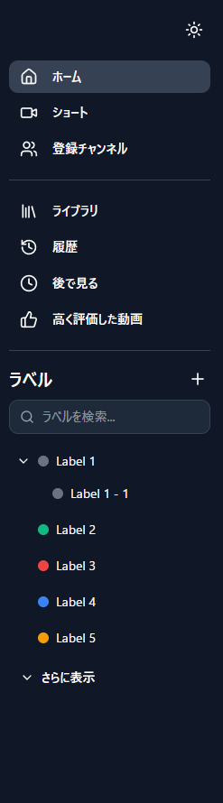

# システム要件定義書 (System Requirements Definition)

## 1. プロジェクト概要

### 1.1. 背景
YouTubeユーザー、特に多数のチャンネル（50以上等）を登録しているヘビーユーザーにおいて、標準の「登録チャンネル」リストは一列に羅列されるのみであり、目的のチャンネルを見つけることが困難になっている。また、ジャンルごとに視聴したいというニーズに対して、現状のUIは最適化されていない。

### 1.2. 目的
登録チャンネルを任意の「カテゴリ」に分類・整理できるChrome拡張機能「TubeShelf」を開発し、ユーザーが快適に登録チャンネルをブラウズできるようにする。Gmailのラベル機能のような階層構造を持つ整理機能を提供する。

    
    

### 1.3. ターゲットユーザー (ペルソナ)
- **属性**: YouTubeを日常的に長時間視聴するユーザー。
- **課題**: 登録チャンネル数が多く（100以上）、整理されていないため、見たい動画を見逃したり、探すのに時間を要している。
- **ニーズ**: 「ゲーム実況」「技術系」「ニュース」「音楽」「J-POP」など、自分の基準でチャンネルをグルーピングしたい。

## 2. システム化の範囲

### 2.1. 対象プラットフォーム
- Google Chrome ブラウザ（PC版）
- 対象サイト: YouTube (https://www.youtube.com/*)

### 2.2. システム構成
- **Frontend**: Chrome Extension (Manifest V3)
    - Content Scripts: YouTubeのDOM操作（サイドバーへの注入）
    - Popup/Options Page: 設定およびカテゴリ管理
    - Background Service Worker: データ管理、同期
- **Storage**:
    - Chrome Storage API (Sync/Local) を使用し、ユーザー設定とカテゴリ構造を保存。
    - 外部データベースサーバーは（現時点では）使用しない。

## 3. 業務フロー (ユースケース)

### 3.1. 導入時
1. ユーザーがChrome Web Storeから拡張機能をインストールする。
2. YouTubeを開くと、再度バーに「TubeShelf」のエリアが表示される。
3. 初期状態では、未分類の登録チャンネルが表示される。

### 3.2. カテゴリ作成・整理
1. ユーザーは「カテゴリ作成」を行い、フォルダを作成する。
2. 登録チャンネルをドラッグ＆ドロップでカテゴリに移動する。

### 3.3. 日常利用
1. YouTube閲覧時、拡張機能によって生成されたサイドバーからカテゴリを選択する。
2. そのカテゴリに属するチャンネルのみが表示される、またはそのカテゴリの新着動画一覧ページへ遷移する（機能要件に依存）。
